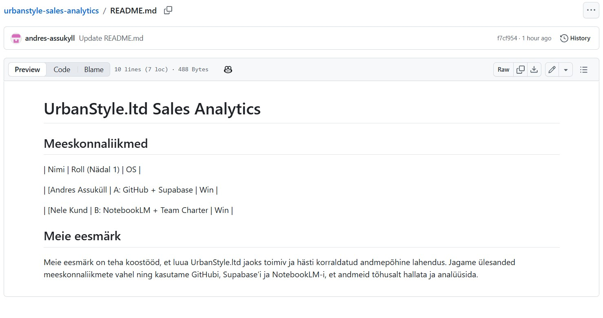
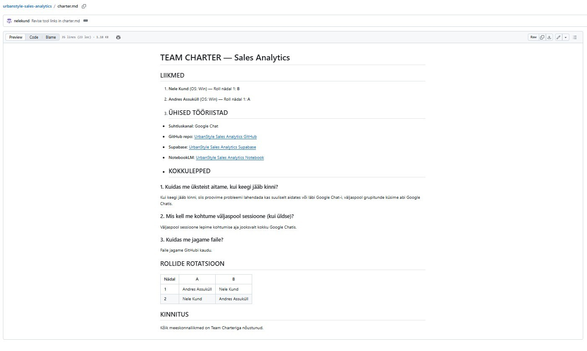
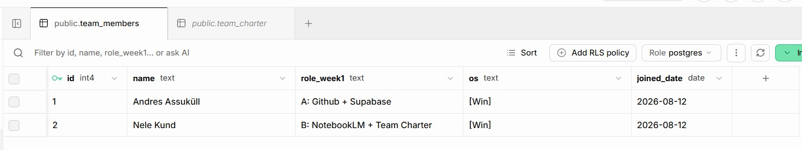
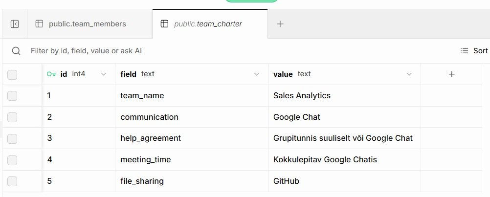
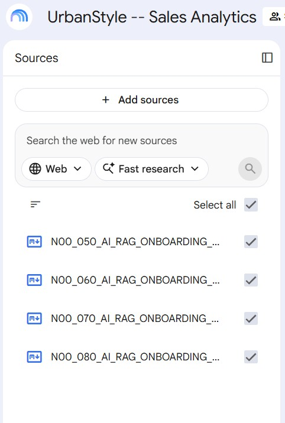

# 🚀 TERE, URBANSTYLE!

**MEESKOND:** UrbanStyle.ltd Sales Analytics  
**NÄDAL:** 0  
**TEGELANE:** Toomas Kask

---

## 🔗 KÕIK SÜSTEEMID ÜHENDATUD

| Süsteem | Link | Sisu |
|---|---|---|
| 🐙 GitHub | [https://github.com/andres-assukyll/urbanstyle-sales-analytics] | `readme.md` + `charter.md` |
| 🗄️ Supabase | [https://supabase.com/dashboard/project/ntvsfakazdrfesjltfzz/editor/17479?schema=public | `team_members` + `team_charter` |
| 🧠 NotebookLM |[https://notebook.google.com/notebook/61c5a45a-eb0a-4228-b5f5-d3867166bce2] | `4 CORE RAG` + `Audio Overview` |
| 📜 Team Charter | GitHub + Supabase | Sotsiaalne leping |

---

## 🐙 GitHub: ✅ 

**`ReadMe` + `Team Charter`**

---

## 🗄️ Supabase:✅

**`team_members` + `team_charter` tabelid**

---

## 🧠 NotebookLM: ✅

<h2>🎧 <strong>Kuulamiseks:</strong></h2>

▶️ <strong><a href="https://andres-assukyll.github.io/urbanstyle-sales-analytics/">
Kuula meie audio kokkuvõtet
</a></strong>  

### **`4 CORE RAG` + `Audio Overview`**

---
 

## 💡 SUURIM ÜLLATUS 
> **"Mahukas materjal saab kuuldavaks."** 

Üllatuseks oli **NotebookLM** audiofunktsioon, mis võimaldab mahukast materjalist kiiresti arusaadava ülevaate saada. Eriti huvitav oli võimalus kohandada audio fookust vastavalt vajadusele. See näitas, et suure materjalihulgaga töötamine ei pea piirduma ainult teksti lugemisega.

 

## 🎯 SOOVITUS TOOMASELE
> **„Ühine töökeskkond, ühine teadmine.“**

Suunata ka edasine fookus **ühise töökeskkonna arendamisele** (GitHub, Supabase jt), kus vajalikud andmed on kogu tiimile **kättesaadavad, korrastatud ja lihtsasti hallatavad**.

 

## ⚠️ PUUDUVAD ANDMED
> **„Iga andmekild loob pildile uue varjundi.“**

Oleks võinud olla **rohkem reaalseid andmeid**, mille põhjal hinnata, kuidas töökeskkonnad edaspidi toimivad.

   

  <strong>URBANSTYLE.LTD</strong> 
  Sales Analytics 2026

