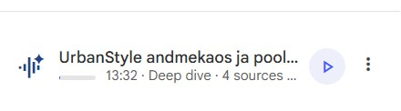

# 🚀 HELLO, URBANSTYLE!

**MEESKOND:** UrbanStyle.ltd Sales Analytics  
**NÄDAL:** 0  
**TEGELANE:** Toomas Kask

---

## 🔗 KÕIK SÜSTEEMID ÜHENDATUD

| Süsteem | Link | Sisu |
|---|---|---|
| 🐙 GitHub | [https://github.com/andres-assukyll/urbanstyle-sales-analytics] | `readme.md` + `charter.md` |
| 🗄️ Supabase | [https://supabase.com/dashboard/project/ntvsfakazdrfesjltfzz/editor/17479?schema=public | `team_members` + `team_charter` |
| 🧠 NotebookLM |[https://notebook.google.com/notebook/61c5a45a-eb0a-4228-b5f5-d3867166bce2] | `4 CORE RAG` + `Audio Overview` |
| 📜 Team Charter | GitHub + Supabase | Sotsiaalne leping |

---

## 🐙 GitHub: ✅ 

**`ReadMe` + `Team Charter`**

---

## 🗄️ Supabase:✅

**`team_members` + `team_charter` tabelid**

---

## 🧠 NotebookLM: ✅

  🎧 <strong>Audio Overview</strong>  
  <a href="audio/urbanstyle-audio.mp3">
    ▶️ Kuula meie Audio Overview'd
  </a>

### **`4 CORE RAG` + `Audio Overview`**

---
 

### 💡 SUURIM ÜLLATUS

tulemas

### 🎯 SOOVITUS TOOMASELE

tulemas

### ⚠️ PUUDUVAD ANDMED

tulemas

   

  <strong>URBANSTYLE.LTD</strong> 
  Sales Analytics 2026

