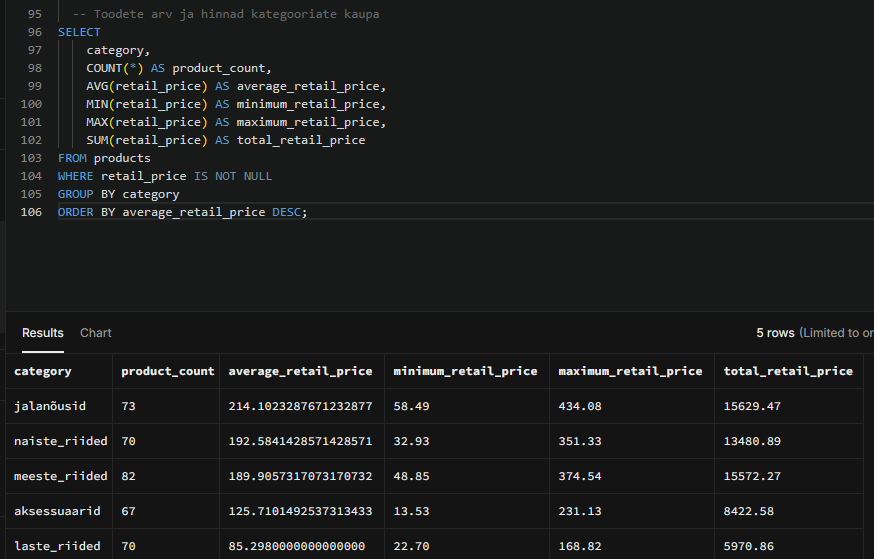

# Product Data Explorer -Week 1

**Tegija:** Evelyn Uusmaa
**Roll:* Product Data Explorer
**Andmetabel:* 'products'

# Ülesanne
Minu ülesanne oli uurida `products` tabeli struktuuri, andmete kvaliteeti ja toodetega seotud põhinäitajaid. Analüüsi tegin Supabase’i SQL-andmebaasis.

## Andmestiku ülevaade
`products` tabel sisaldab:

- 362 rida;
- 9 veergu;
- toodete, kategooriate ja alamkategooriate andmeid;
- tarnijate andmeid;
- oma- ja müügihindu;
- keskkonnasertifikaadi tunnust;
- toodete loomise kuupäevi.

Kontrollimise tulemusel ei leidnud ma tabelist puuduvaid väärtusi.

## Kasutatud SQL-i võtted

- `SELECT` – vajalike andmete pärimiseks;
- `WHERE` – andmete filtreerimiseks;
- `ORDER BY` – tulemuste sorteerimiseks;
- `LIMIT` – kuvatavate tulemuste piiramiseks;
- `DISTINCT` – unikaalsete väärtuste leidmiseks;
- `COUNT()` – ridade loendamiseks;
- `GROUP BY` – andmete rühmitamiseks;
- `AVG()`, `MIN()`, `MAX()` ja `SUM()` – hinnainfo analüüsimiseks;
- `AND` ja `OR` – tingimuste kombineerimiseks;
- `IS NULL` – puuduvate väärtuste kontrollimiseks.

## Tulemus

## Suurim tähelepanek
`products` tabel oli andmekvaliteedi poolest korras: kontrollitud veergudes ei esinenud puuduvaid väärtusi. See võimaldas andmeid kohe filtreerida, sorteerida ja kategooriate kaupa analüüsida.