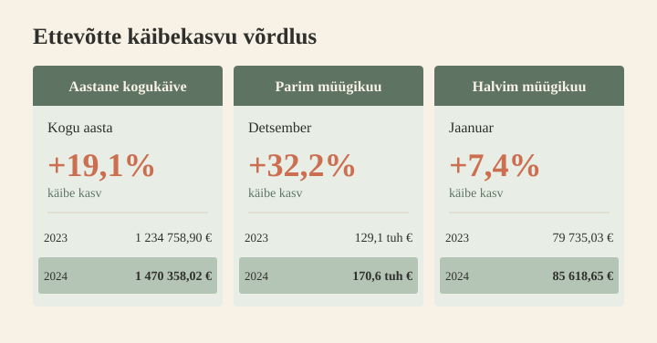
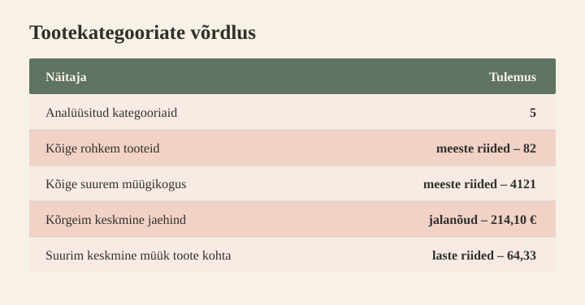

## MEESKOND: Sales Analytics  |  NÄDAL: 4 |  TEGELANE: Anna Mets, Kristi Tamm, Liis Koppel

---

## 👥 Meeskonnaliikmed

| Nimi | Roll (Nädal 4) | OS |
|---|---|:---:|
| Nele Kund | A: [Müügi koondandmed](sales-aggregation.md) | 🪟 Win |
| Andres Assuküll | B: [Kliendigruppide analüüs](customer-segmentation.md)  | 🍎 Mac |
| Evelyn Uusmaa | C: [Inventuuristatistika](inventory-statistics.md) | 🪟 Win |

---

## 🎯 Müügiandmete koondraport:

 < *tulemas*

### Peamised leiud (3 punkti — üks igalt rollilt)

**Kokkuvõte (A)**: Müük   
  
...

**Kokkuvõte (B)**: Kliendigrupid  
  
Tuvastatud klientide käive moodustab **90% kogukäibest**. Kõige väärtuslikumasse segmenti kuulub vaid **19 VIP-klienti**, kelle käive moodustab **13,2% kogukäibest** ja kellest **14** asuvad Tallinnas või Pärnus.

**Kokkuvõte (C)**: Inventuur   

   
### Suurim üllatus
**(B)** VIP kliendi keskmine käive on **18 227 €**, mis on **11.3 korda** suurem kui tavaklientidel ja **37 korda** suurem kui uutel klientidel.  

### Soovitus Annale ja Kristile

**(A)** .. 
 
**(B)** Hoia fookus VIP-klientide säilitamisel ning tavaklientide kasvatamisel VIP tasemele, eelkõige Tallinnas ja Pärnus. 
 
**(C)** Kontrolli Tartu poe meeste- ja lasteriiete laoseisu ning kasuta kõrvalekallete tuvastamiseks iganädalast erandite raportit.

### Puuduvad andmed

**A** 
**(B)** Pole.
   
> *Slaidiesitluseks koondame siia esmalt kokku need punktid, mis slaidile lähevad.*
