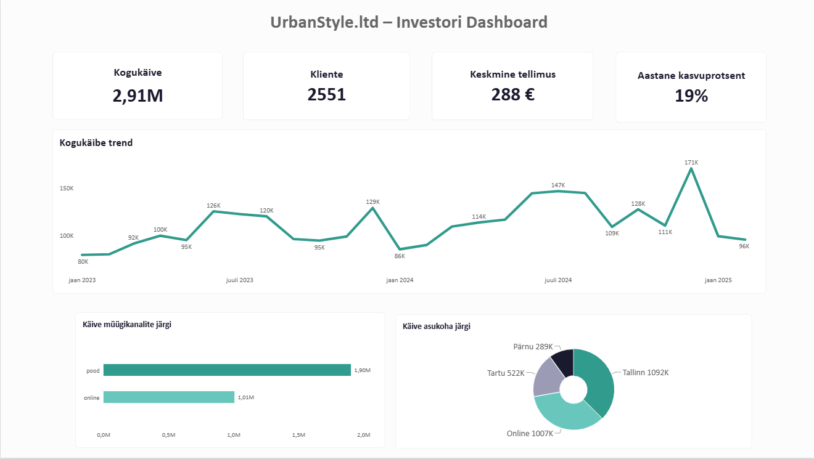

## MEESKOND: Sales Analytics  |  NÄDAL: 5 |  TEGELANE: Kristi Tamm, Anna Mets, Liis Koppel

---

## 👥 Meeskonnaliikmed

| Nimi | Roll (Nädal 5) | OS |
|---|---|:---:|
| Evelyn Uusmaa | A: [CEO + Operations]() | 🪟 Win |
| Nele Kund | B: [Marketing + Koondvaade](marketing-dashboard.md) | 🪟 Win |
| Andres Assuküll | C:   | 🍎 Mac |

---

## 📊 UrbanStyle dashboardide koondvaade

---

## Peamised leiud

### A: CEO Dashboard

UrbanStyle’i kogumüügitulu on **2,67 miljonit eurot** ning müügiandmetes on **2558 ostnud klienti**. Müügitulu kasvas 2024. aastal võrreldes 2023. aastaga **19,08%**, mis näitab ettevõtte positiivset arengut.

Kuupõhine müügitulu kõigub, kuid 2024. aasta üldine tase on varasemast kõrgem. Hilisemate perioodide andmete täielikkust tuleb enne juhtimisotsuste tegemist kontrollida.

➡️ [Vaata CEO Dashboardi](ceo-dashboard.md)

### B: Marketing Dashboard

Suurima käibega müügikanal on **Tallinna pood**, millele järgneb online-kanal. Uute klientide lisandumine kõigub kuude lõikes ning hilissuvel ja sügise alguses on näha korduvat vähenemist.

Turundustegevustes tasub pöörata tähelepanu online-kanalile ning tugevdada kampaaniaid perioodidel, mil uute klientide lisandumine väheneb.

➡️ [Vaata Marketing Dashboardi](marketing-dashboard.md)

### C: Operations

Andrese Operations-analüüs lisatakse pärast selle valmimist.

### D: Investori kokkuvõte

UrbanStyle'i aastane kasv on **19%** (2023 → 2024). Kasvu toetab online-müügi ja füüsiliste poodide kombinatsioon. Suurima käibega on Tallinna pood **(1,09 mln €)**, millele järgneb vaid väikese vahega e-pood **(1,01 mln €)**
 
**Soovitus:** Suurendada turundustegevusi augustis-septembris ja alustada varakult aastalõpukampaaniatega.
