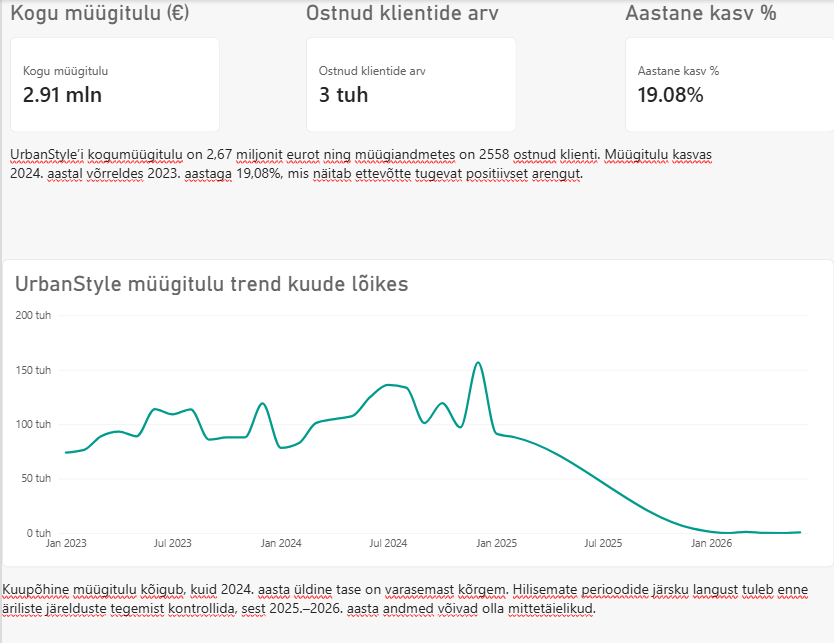

# CEO ja Operations Dashboard – Week 5

**Tegija:** Evelyn Uusmaa  
**Roll:** A – CEO + Operations Dashboard  
**Andmeallikad:** `sales`, `inventory`, `products` tabelid (Supabase)  
**Tööriist:** Power BI  

## Ülesanne

Minu ülesanne oli koostada UrbanStyle’i juhtimis- ja operatsioonivaade. CEO vaade annab ülevaate müügitulust, klientidest ja aastasest kasvust. Operations vaade näitab müügitulu kaupluste lõikes ning laoseisu tootekategooriate järgi.

## Peamised tulemused

| Näitaja | Tulemus |
|---|---:|
| Kogu müügitulu | 2,91 miljonit eurot |
| Ostnud klientide arv | 2551 |
| Müügitulu kasv 2024 vs 2023 | 19,08% |

## CEO Dashboard

UrbanStyle’i kogumüügitulu on **2,91 miljonit eurot** ning müügiandmetes on **2551 ostnud klienti**. Müügitulu kasvas 2024. aastal võrreldes 2023. aastaga **19,08%**, mis näitab ettevõtte tugevat positiivset arengut.

Kuupõhine müügitulu kõigub, kuid 2024. aasta üldine tase on varasemast kõrgem. Hilisemate perioodide järsku langust tuleb enne äriliste järelduste tegemist kontrollida, sest 2025.–2026. aasta andmed võivad olla mittetäielikud.

## Operations Dashboard

### Müügitulu kaupluste lõikes

Tallinn on suurima müügituluga müügikoht, moodustades ligikaudu **37% kogumüügist**, ning sellele järgneb väga lähedalt online-kanal. Pärnu müügitulu on kõige väiksem, mistõttu tasub hinnata sealse poe müügitulemusi ja tegevusmahtu.

### Laoseis kategooriate lõikes

Kõige suurem laoseis on meeste riiete kategoorias, samas kui kõige väiksem laoseis on aksessuaaridel. Väiksema laoseisuga kategooriate puhul tuleb võrrelda laokoguseid müügikiiruse ja tellimispunktidega, et vältida kaupade lõppemist.

## Kokkuvõte

Dashboard aitab juhtkonnal jälgida ettevõtte müügitulemusi ja annab operatsioonijuhile ülevaate kaupluste müügitulust ning laovarude jaotusest. Peamised tähelepanu vajavad kohad on Pärnu väiksem müügitulu, madalama laoseisuga kategooriad ja hilisemate perioodide andmete täielikkus.
