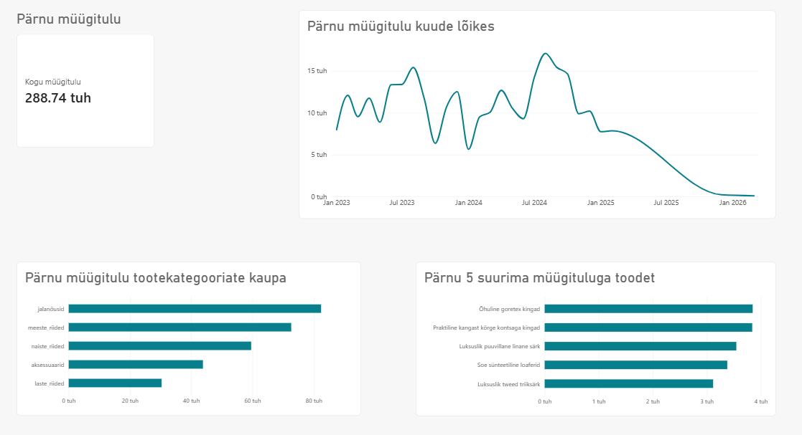
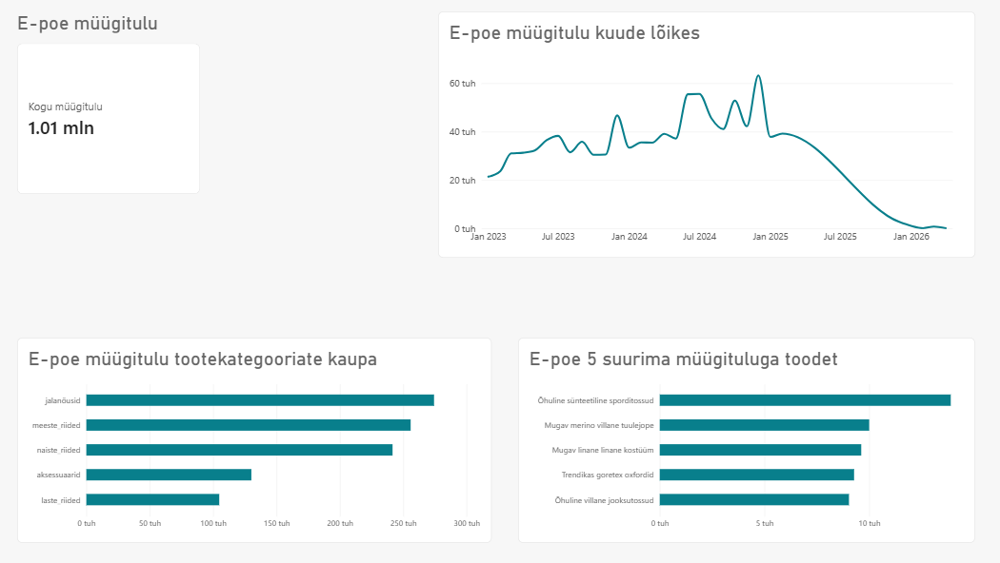

# Nädal 6 – Visualiseerimise andmed

## Grupitöö eesmärk

UrbanStyle'il on kolm füüsilist kauplust ja e-pood. Grupitöö eesmärk on koostada asukohtadele eraldi dashboard'id, selgitada nende tulemusi ärilises keeles ning ühendada vaated meeskonna koondlooks turundusjuht Anna Metsa jaoks.

## Minu ülesanne

**Koostaja:** Evelyn Uusmaa  
**Roll kahe liikmega meeskonnas:** Pärnu kauplus ja e-pood

Juhendi järgi tuli mul koostada Pärnu kaupluse ja e-poe (Online) dashboard koos andmelooga. Pärnu puhul oli fookuses võimalik hooajalisus ja selle mõju kaupluse planeerimisele. E-poe puhul oli fookuses müügi muutumine ajas ning digitaalse kanali potentsiaal. Mõlema vaate jaoks tuli esitada juhtidele peamised järeldused, selgitavad annotatsioonid diagrammidel ja üks viitejoon.

## Pärnu kaupluse dashboard

### Järeldused juhtidele

1. **Pärnu kogumüügitulu on 288,74 tuhat eurot.** See annab asukohapõhise ülevaate, kuid otsuste tegemiseks tuleb vaadata ka seda, millal müük toimus.
2. **Kõige kõrgem nähtav müügiperiood on 2024. aasta teisel poolel.** Kuukäive ulatub graafikul ligikaudu 17 tuhande euroni. See viitab, et tugevateks müügiperioodideks tasub varusid ette planeerida.
3. **Suvi ei ole ainsana tugev periood.** Graafikul esineb müügitippe ka muul ajal ning mõni nõrgem kuu jääb suve lähedusse. Seetõttu ei saa üksnes selle vaate põhjal väita, et Pärnu müüki juhib ainult turismihooaeg.
4. **Jalatsid toovad tootekategooriatest suurima müügitulu, ligikaudu 82 tuhat eurot.** Neile järgnevad meeste- ja naisteriided. Varude planeerimisel tasub jälgida just nende kategooriate nõudlust.
5. **Graafiku lõpus langeb kuukäive peaaegu nulli.** Enne selle tõlgendamist tegeliku müügilangusena tuleb kontrollida, kas 2025. aasta viimaste kuude ja 2026. aasta alguse müügiandmed on täielikud.

### Pärnu andmelugu

Pärnu vaates uurisin, kas väiksema kaupluse müügis avaldub selge hooajalisus. Kõrgeim nähtav kuukäive jääb 2024. aasta teise poolde, kuid tugevamaid ja nõrgemaid kuid esineb ka väljaspool üht kindlat hooaega. Jalatsid on suurima müügituluga kategooria, mistõttu tasub nende varusid tugevamateks müügikuudeks ette planeerida. Soovitan võrrelda samade kuude tulemusi eri aastatel ja kontrollida viimaste kuude andmete täielikkust, enne kui teha otsus eraldi suve- või talvestrateegia kohta.

## E-poe (Online) dashboard

### Järeldused juhtidele

1. **E-poe kogumüügitulu on 1,01 miljonit eurot.** See on UrbanStyle'i jaoks oluline müügikanal ja väärib eraldi jälgimist.
2. **Kõrgeim nähtav kuukäive jääb 2024. aasta lõppu.** Graafiku tipp ületab ligikaudu 60 tuhat eurot. Tasub uurida, millised tooted või tegevused selle tulemusega samal ajal esinesid; ainult graafik ei näita tõusu põhjust.
3. **Jalatsid on ka e-poes suurima müügituluga kategooria, ligikaudu 275 tuhat eurot.** Järgnevad meeste- ja naisteriided. See aitab seada prioriteete tootevaliku ja veebipoe esilehe planeerimisel.
4. **E-poe viie suurima müügituluga toote hulgas on mitu jalatsit.** Enne üksiktoodete reklaamieelarve suurendamist tuleks võrrelda ka nende kasumit ja laoseisu, mida käesolev vaade ei näita.
5. **2025. aasta jooksul langeb graafiku lõpuosa peaaegu nulli.** Sellest ei saa veel järeldada, et e-poe nõudlus kadus: esmalt tuleb kontrollida andmete ajavahemikku ja viimaste kuude täielikkust.

### E-poe andmelugu

E-pood moodustab UrbanStyle'i müügist märkimisväärse osa: vaates kuvatud kogumüügitulu on 1,01 miljonit eurot. Kõrgeim nähtav kuukäive ületab 2024. aasta lõpus ligikaudu 60 tuhat eurot ning jalatsid on suurima müügituluga tootekategooria. Hilisem langus vajab andmete täielikkuse kontrolli, enne kui seda saab käsitleda ärilise probleemina. Soovitan uurida tipukuude tooteid ja kampaaniaid ning võrrelda neid kasumi ja laoseisuga, et teha põhjendatud otsus e-poe järgmiste tegevuste kohta.

## Andmete tõlgendamise piirang

Mõlema dashboard'i ajatelg ulatub 2026. aasta alguseni ja joone lõpus on müük peaaegu null. Kuna viimaste perioodide andmete täielikkus ei ole siin kinnitatud, ei käsitle ma seda automaatselt tegeliku müügi kadumisena. Samuti ei saa üksnes müügitulu graafiku põhjal kinnitada kampaania, turismi või muu sündmuse mõju.

## Panus meeskonna koondvaatesse

Pärnu ja e-poe vaated annavad kaks osa UrbanStyle'i asukohtade võrdlusest. Meeskonna ühises koondvaates saab neid võrrelda Tallinna ja Tartu tulemustega ning sõnastada Anna Metsale kogu ettevõtet puudutava soovituse.

## AI kasutamine

Kasutasin ChatGPT-d dashboard'idel nähtavate tulemuste sõnastamiseks ja Markdown-faili ülesehitamiseks. Kontrollisin, et järeldused ei esitaks oletusi müügimuutuste põhjuste ega puudulike perioodiandmete kohta faktidena.