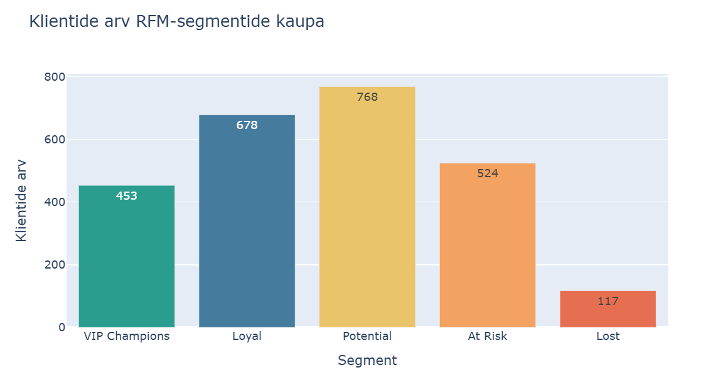

# RFM-analüüs: leiud ja soovitused Markole

**Koostaja:** Evelyn Uusmaa  
**Analüüsi seis:** 28.02.2025  
**Märkmik:** [RFM-analüüs koos kommentaaridega](week7_rfm_complete.ipynb)

## Tulemused

Analüüs hõlmab 2540 ostnud klienti ja 8923 positiivset müügikirjet.

| Kliendisegment | Kliente | Osakaal |
|---|---:|---:|
| VIP Champions | 453 | 17,8% |
| Loyal | 678 | 26,7% |
| Potential | 768 | 30,2% |
| At Risk | 524 | 20,6% |
| Lost | 117 | 4,6% |

## Graafikud

### Klientide arv segmentide kaupa

### Klientide ostukäitumine

### Kümme suurima ostusummaga VIP-klienti

## Peamine leid

Potential on suurim segment: 768 klienti ehk 30,2% analüüsitud
klientidest. Sellele rühmale tasub katsetada kordusostu soodustavaid
pakkumisi. VIP- ja lojaalseid kliente on kokku 1131 ning At Risk
ja Lost segmentides kokku 641 klienti.

Kümne suurima ostusummaga VIP-kliendi ostude kogusummad jäävad
ligikaudu 20 318–27 921 euro vahele.

## Soovitused Markole

- **Potential:** katsetada personaalset kordusostu pakkumist.
  Mõõta 30 päeva jooksul uuesti ostnud klientide osakaalu ja
  võrrelda tulemust pakkumist mitte saanud kontrollrühmaga.
- **VIP Champions ja Loyal:** pakkuda varajast ligipääsu uutele
  kollektsioonidele. Jälgida kordusostumäära ja ostusumma muutust.
- **At Risk ja Lost:** katsetada tagasivõitmise kampaaniat.
  Mõõta, kui paljud kliendid ostavad uuesti ning kas kampaania
  tulemus katab pakkumise kulud.

## Tulemuste kasutamine

Analüüs kirjeldab olukorda seisuga 28.02.2025. Enne kampaaniate
käivitamist tuleb segmendid ajakohaste andmetega uuesti arvutada.

Ostusummad sisaldavad ainult positiivseid oste, tagastusi pole
maha arvestatud. Lost on mudeli kategooria ega tõesta kliendi
lõplikku lahkumist. Ostudeta kliendid RFM-tabelisse ei kuulu.