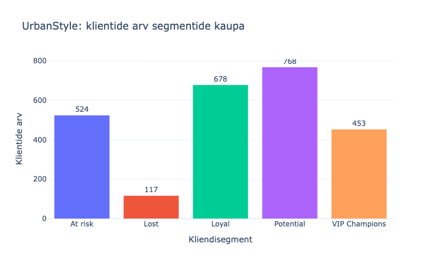
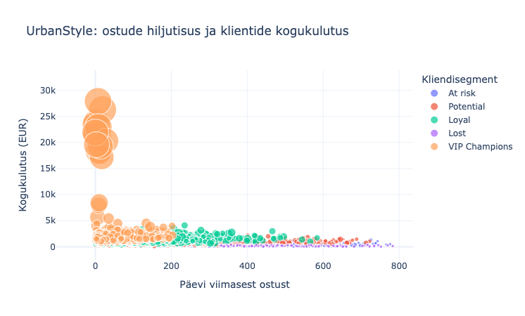
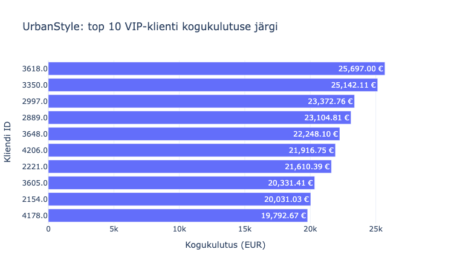

### RMF
  
  

### V
Analüüsitud klientidest kuulub VIP segmenti **450**.  
Nende kogukulutus **1 104 225.48 €** moodustab **42.6%** analüüsitud klientide kogukulutusest.  
**At Risk** segmendis on **510** klienti  
     – viitab tähelepanu vajavale kliendirühmale, kuid ei tõenda nende lahkumist.  
VIP-klientidele soovitan varajast ligipääsu uutele kollektsioonidele ja eritingimusi. 
At Risk klientidele personaalset 14-päevast tagasivõitmispakkumist, mille tulemust mõõta 30 päeva kordusostumäära ja kontrollrühmaga võrdlemise kaudu. 

Kuna RFM-analüüsi viitekuupäev on 28.02.2025, tuleb enne kampaaniate käivitamist kliendisegmendid värskendada.

### VI
**VIP programm**: paku klientidele varajast ligipääsu uutele kollektsioonidele ja tasuta tarnet alates kindlast ostusummast. Testi programmi 60 päeva ning mõõda kordusostumäära ja kasumit kliendi kohta.
**Win-back kampaania**: saada At Risk klientidele personaalne pakkumine, näiteks 10% soodustus kehtivusega 14 päeva, ja üks meeldetuletus 7. päeval. Võrdle 30 päeva ostumäära kampaaniat mitte saanud kontrollrühmaga ning kontrolli, kas lisamüük katab soodustuse kulu.
**Nurture programm**: suuna hiljutised ühe ostuga kliendid tervitussarja: pärast ostu kasutusnõuanded ja 14 päeva pärast sobivate toodete soovitused. Mõõda, kui paljud teevad 30 päeva jooksul teise ostu; uue kliendi staatust kinnita täieliku ostuajaloo põhjal.
Enne kampaaniate käivitamist värskenda RFM-segmendid, sest praeguse analüüsi viitekuupäev on 28.02.2025.
